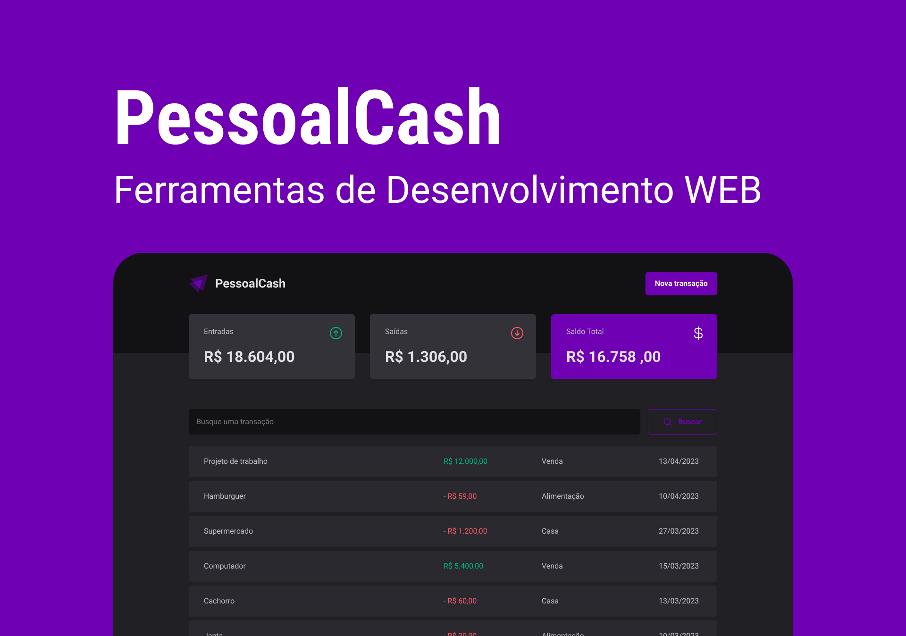

# PessoalCash

 
 

You can preview the project layout [clicking here](https://www.figma.com/file/ZCb5TKLHArHnUne2JMaJy4/PessoalCash?type=design&node-id=32%3A151&mode=design&t=hBTAhdcQfvebBXvm-1). Please note that a [Figma](https://figma.com) account is required to access it.

## 💻 About this project

This work aims to present a proposal for a web application for personal financial control.

I'll be happy if you could send me any feedback about the project, code, structure or anything that you can report that could make me better as a developer!

And you can use this project as you wish!

## 🚀 Built with

This project was built with:

- HTML
- CSS
- JavaScript

## 📩 Reach me out

You can reach me at:

Reach me at: livof18@gmail.com

Connect with me at [LinkedIn](https://www.linkedin.com/in/liviaolivf/)

## 📝 License

This project is licensed under the MIT License - see the [LICENSE.md](./LICENSE.md) file for details.